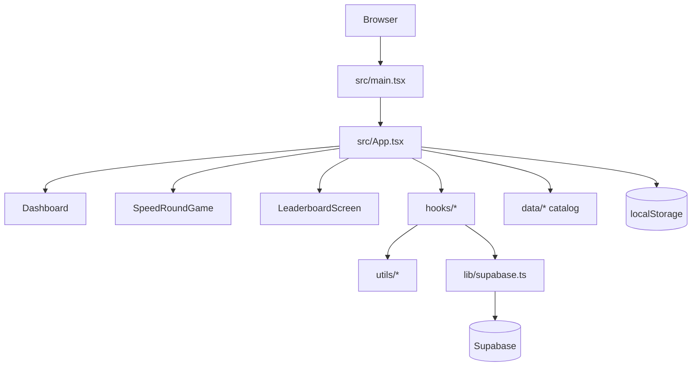

# Codebase Map — Last Day Words

Created: 2026-07-09 · Last updated: 2026-07-10 · Confidence: High (client SPA)

## 0 · Snapshot

| Field | Value |
|---|---|
| Purpose | Prophetic **speed arcade**: timed clue→word solves, dual weekly boards, streaks, XP |
| Stack | TypeScript · React 19 · Vite 6 · Tailwind 4 · Supabase (optional) |
| Shape | Single Vite SPA + PWA |
| Persistence | `localStorage` + optional Supabase Auth/Postgres |
| Content | Bundled catalog **76 chapters / 380 words** (+ remote catalog when seeded) |

**One-paragraph summary:** Last Day Words is an offline-first speed game. Players pick **Mixed Speed** (expansion pool) or **Chapter Speed** (one of 20 core tracks). Scores post to separate weekly boards (`speed_scores.mode`). Day-lamp streak advances when a speed run with solves is banked after the end-screen Continue. Hangman chapter runs and the `daily_scores` table are removed.

---

## 1 · Product modes

| Mode | Entry | Notes |
|---|---|---|
| Mixed Speed | Dashboard | Pool = non-core chapters (`speedPools.getMixedSpeedWords`) |
| Chapter Speed | Dashboard → chapter list | One core chapter’s terms only |
| Weekly boards | Leaderboard screen | Tabs Mixed / Chapter; SAST Sunday week key |
| Word bank | AboutStudyGuide | Offline browse clues/verses |
| Teams / Online | Dashboard grid | Local + room codes |
| Auth | AuthScreen | Optional; required for cloud boards |

**Out of product:** chapter hangman, daily hangman challenge, `daily_scores` cloud board, Gemini/AI Studio.

---

## 2 · Architecture



- **Router:** `GameMode` in `src/types.ts` + switch in `App.tsx`.
- **Pools:** `src/utils/speedPools.ts` — disjoint Mixed vs Chapter content.
- **Round end:** show score → manual **Continue** → `applySpeedRoundToProgress` + optional `speed_scores` upsert (`useGameSession`).
- **Week key:** `getLeaderboardWeekKey()` — Sunday–Saturday SAST (`calendarKeys.ts` / `leaderboard.ts`).

---

## 3 · Key paths

| Path | Role |
|---|---|
| `src/App.tsx` | Mode routing, progress wiring |
| `src/components/SpeedRoundGame.tsx` | Timed round UI; defers progress until Continue |
| `src/components/Dashboard.tsx` | Mixed / Chapter entry, streak, ranks |
| `src/components/LeaderboardScreen.tsx` | Dual weekly boards |
| `src/hooks/useGameSession.ts` | Bank XP/highs/streak + leaderboard upsert |
| `src/utils/speedRoundProgress.ts` | Pure progress apply after a round |
| `src/utils/leaderboard.ts` | Ranks, SAST week, top-3 revocable badges |
| `src/utils/progression.ts` | Perfect / speed / study XP |
| `src/data/words.ts` + expansions | Bundled catalog |
| `supabase/migrations/` | Schema + seeds (remote apply) |
| `supabase/seed_content.sql` | Full content upsert snapshot |

**Audit / research archives (keep):** `docs/word-audit-*`, `docs/expansion-*`, `docs/STUDY_*`, `docs/words-catalog-export.json`, `RESEARCH_LOG.md`.

---

## 4 · Data

### Client progress (`UserProgress`)

- Streak fields still named `dailyChallengeStreak` / `dailyChallengeCompletedDate` (legacy keys; advanced by speed, not hangman).
- Per-mode highs: `speedMixedHighScore`, `speedChapterHighScore`, plus legacy overall highs.
- Weekly badge placement: `leaderboardRanks` + revocable `weekly-{mixed|chapter}-{1..3}` ids.

### Supabase (canonical `schema.sql`)

| Table | Purpose |
|---|---|
| `profiles` | Display names |
| `speed_scores` | Weekly board; unique `(user_id, week_key, mode)` |
| `game_rooms` / `room_members` | Online teams |
| `seasons` / `chapters` / `words` / … | Content catalog |
| `user_progress` | XP/rank/cosmetics + `game_state` |

**Removed:** `daily_scores` (migration `20260710200000_drop_daily_scores.sql`).

---

## 5 · XP (current)

| Source | Amount |
|---|---|
| Perfect speed word (0 miss) | +25 each |
| Speed round | `floor(score / 10)` |
| Word bank open | +10 once/day |

No hangman “daily complete +50” award.

---

## 6 · Commands

```bash
npm run dev
npm run lint    # tsc --noEmit
npm test        # vitest
npm run build
```

CI: `.github/workflows/ci.yml` (lint, test, build).

---

## 7 · Ops notes

- Remote-only Supabase: see `docs/SUPABASE_REMOTE_WORKFLOW.md`.
- Apply migrations in order; dual boards need `mode` column before client upserts with `onConflict: user_id,week_key,mode`.
- Catalog counts expected: **76** chapters, **380** words.

---

## 8 · Map changelog

| Date | Change |
|---|---|
| 2026-07-09 | Initial map (pre speed-only pivot) |
| 2026-07-10 | Rewritten for speed arcade; hangman/`daily_scores` removed from product model |
